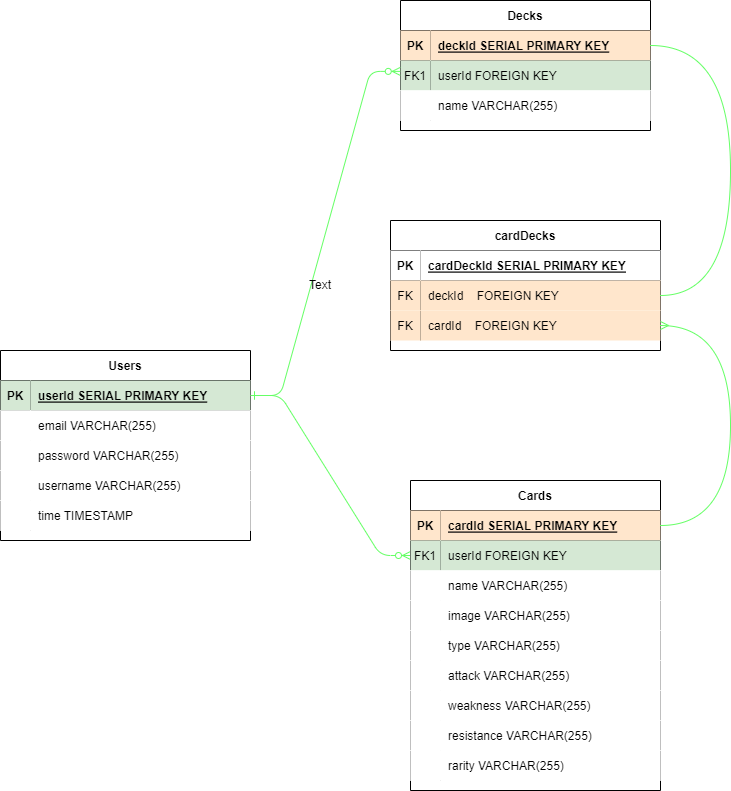
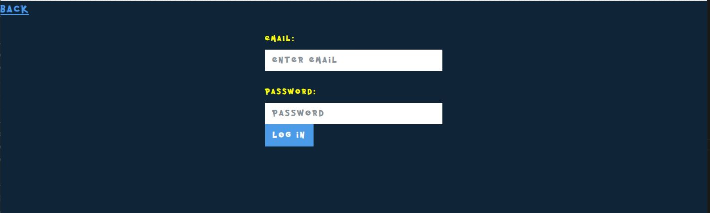
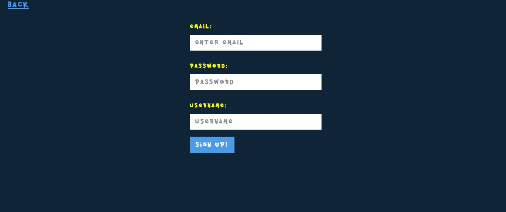
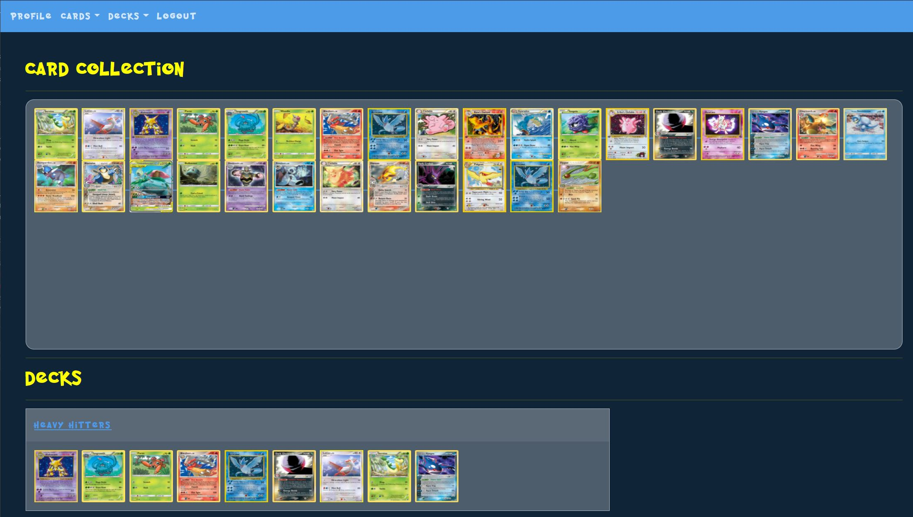
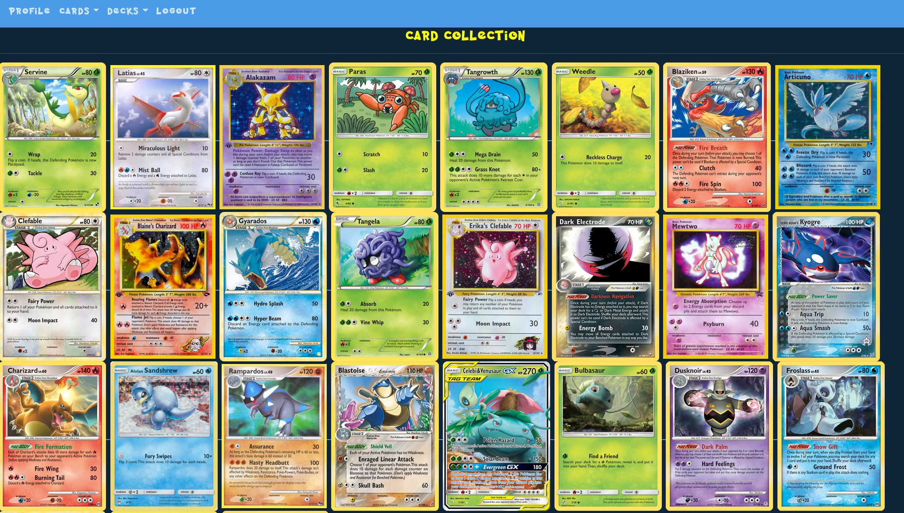
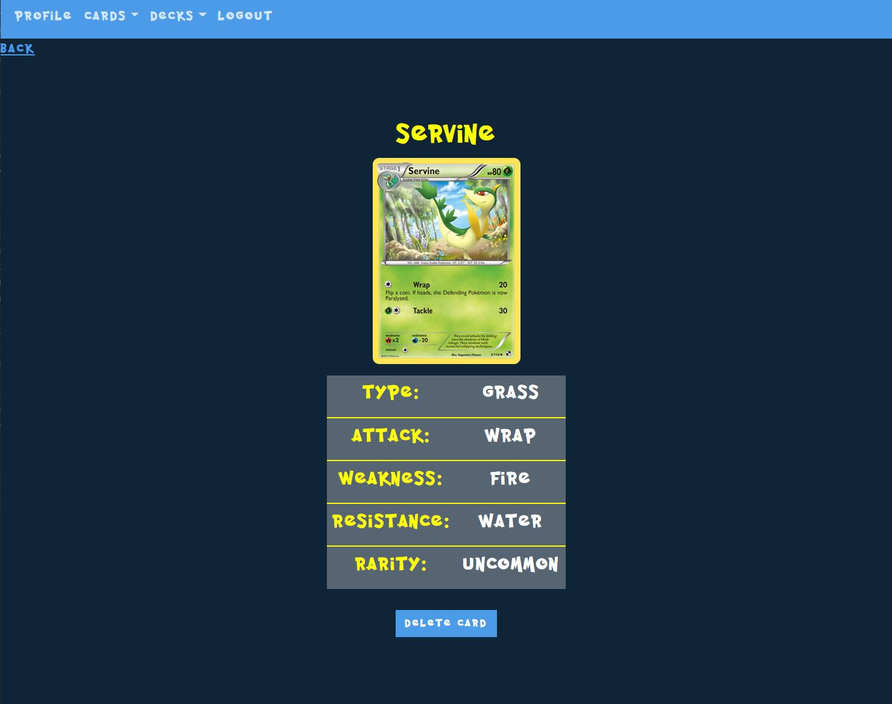
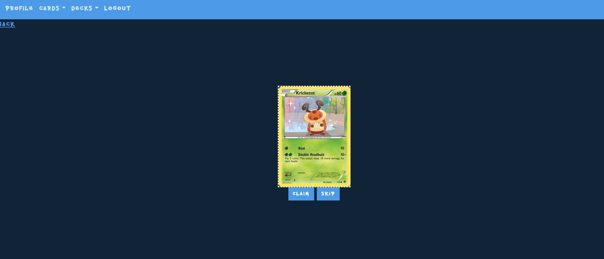
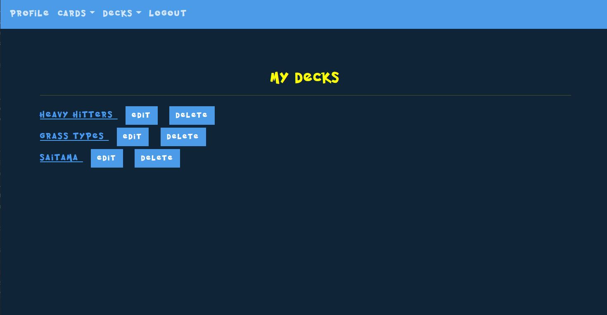

# Project 2 - Pokemon TC-GO
Pokemon has been popular ever since its release in the 1990s and since that day, it has been continously evolving. So much so, the pokemons that you see on tv and gameboys became a reality through Pokemon Cards, in which up to this day is still very popular for its Collection. This app will allow the user to experience the basic trading and collecting part of the game.

## Try-it out


## API / Technologies
- [Pokemon TCG](https://pokemontcg.io/) - a pokemon api containing in-depth data regarding pokemon cards
- NPM list
    - express, express-ejs-layout, axios, methodOverride - for the routes/controllers
- bootswatch and fontspace for layouts

# Installation
1. `Fork` and `clone` this repo [Pokemon:TC-Go](https://github.com/JonDmc/PokeTCG)
2. Run `npm install` to install all the dependencies
3. Setup your postgres database (this app already has two(2) existing models (excluding joint table))
4. Create a database named `poketcg` by running `create database poketcg` on your postgres terminal for WSL, or `createdb poketcg` on MAC.
5. Run `sequelize db:migrate` to run migrations
6. Run `nodemon` to start your application. If you haven't installed it, run `npm install -g nodemon` to install it globally.

## ERDs


# Routes

| Method | Path | Purpose |
| ------ | -------------- | -------------------------------- |
| GET | `/` | Log in page |
| POST | `/SignUp` | Sign up page and receiving of randomized cards |
| GET | `/profile` | displays the User profile, i.e. user's collection |
| GET | `/cards` | displays the User's collection of cards |
| GET | `/cards/new` | generates one new random card each time a button is hit or the page is visited |
| POST | `/cards/new` | creating a copy the claimed card and storing at the db |
| GET | `/cards/:id` | displays the basic information of the card, i.e. name, type, attack,... |
| DELETE | `/cards/:id` | deletes the specific card |
| GET | `/decks` | displays the User's Decks, which consist of 10 cards per deck|
| POST | `/decks/new` | creates a new deck, then redirects back to `GET /decks`|
| GET | `/decks/:id` | display the cards inside the specific deck |
| DELETE | `/decks/:id` | removing the deck |
| PUT | `/decks/:id/edit` | changing name of the specific deck |
| GET | `/decks/:id/add` | displaying all the cards that the user can add to the deck |
| POST | `/decks/:id/add` | adding specific cards inside the specific deck |
| GET | `/decks/:id/remove` | displays all the available cards to remove in the deck |
| POST | `/decks/:id/remove` | removing the card in the specific deck |

# Wireframes
### Collecting part 
#### Log-in page

#### Sign-up page

#### Profile page


#### Cards page



#### Decks page


# User Stories
- As a user, I want to collect/trade cards
- As a user, I want to see my collection of cards
- As a user, I want to build or customize my deck by adding and removing cards
- As a user, I want to see my list of decks
- As a user, I am able to obtain a new card without trading

# MVP Goals
- [x] Be able to fetch and store basic card data from the api
- [x] Be able to display the collection of cards
- [x] Be able to generate a randomized card for the user whenever 'generate' button is hit.
- [x] Be able to 'skip' a generated card, by pressing the skip button, if the user doesn't want the current card. 
- [x] Be able to display the list of decks, and the cards inside that deck
- [x] Be able to add and/or remove cards from a specific deck

# Stretch Goals
### Collecting part (Achieved)
- [x] Be able to make the user wait for 2hrs to have the ability to generate a new card

## Code Highlights
``` const arr1 = []//getting cards
        for (let i = 0; i < viewDeck.length; i++) { //getting the no. of decks created
            const cardsOnDeck = await db.deck.findOne({ //getting the cards from those decks
                where: {
                    id: viewDeck[i].id
                }
            })
            arr1.push(cardsOnDeck.getCards()) //pushing the cards in an array to call later
        }
        const theseCards = await Promise.all(arr1) ```

``` 
<div class="card-body"> 
    <% if(theseCards[index].length> 0) {%>
        <% for( let i=0; i < theseCards[index].length; i++ ) { %>
             "
                style="width: 100px; height: 120px; display:inline;" />
        <% } %>
    <% } else { %>
        <em>
            <h5>Deck is empty</h5>

        </em>
        <%} %>
</div> ```


# Stretch Goals
### Trading part (Future Goals)
- [ ] Be able to post a specific card for trading
- [ ] Be able to comment on different posts with a specific card that the user want to trade with
- [ ] Be able to trade with other users
- [ ] Be able to remove the post, once the trade is complete or when the user deletes it
- [ ] Be able to trade with other people live with the use of mapbox